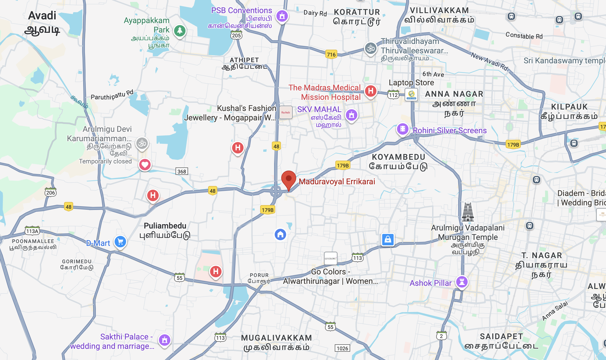
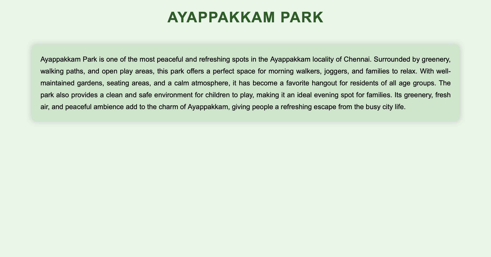
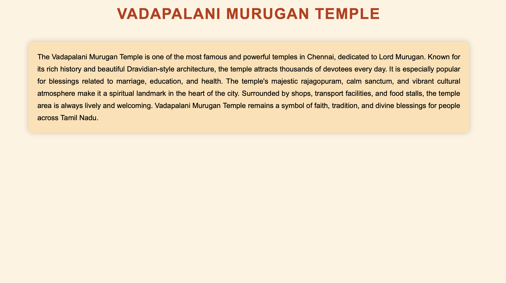
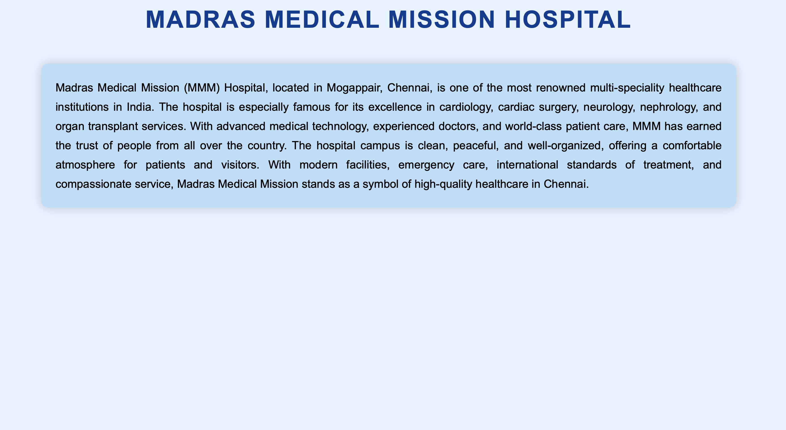
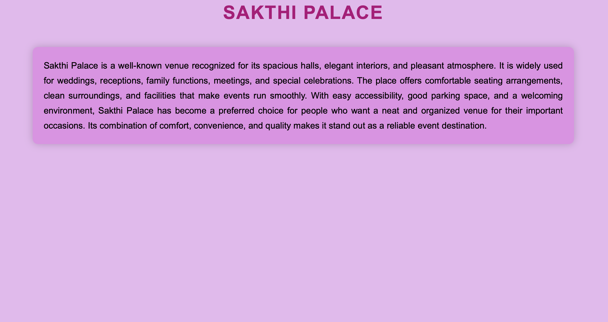

# Ex04 Places Around Me

## Date:07.12.25

## AIM

To develop a website to display details about the places around my house.

## DESIGN STEPS

### STEP 1

Create a Django admin interface.

### STEP 2

Download your city map from Google.

### STEP 3

Using `<map>` tag name the map.

### STEP 4

Create clickable regions in the image using `<area>` tag.

### STEP 5

Write HTML programs for all the regions identified.

### STEP 6

Execute the programs and publish them.

## CODE

```
map html

<!DOCTYPE html>
<html>
  <head>
    <title>MY TOWN</title>
    <style>
      body {
        font-family: Arial, sans-serif;
        background-color: #f0f0f0;
        padding: 20px;
      }
      h1 {
        text-align: center;
        color: #333;
      }
      h2 {
        text-align: center;
        color: #333;
      }
      img {
        margin: 0 auto;
        border: 2px solid #444;
      }
    </style>
  </head>

  <body>
    <h1><b>MADURAVOYAL</b></h1>
    <h2>SAADHANA A (25018432)</h2>
    <!-- Image Map Generated by http://www.image-map.net/ -->
    

    <map name="image-map">
      <area
        target=""
        alt=""
        title="MADURAVOYAL ERIKARAI"
        href="mytown.html"
        coords="897,569,1339,725"
        shape="rect"
      />
      <area
        target=""
        alt=""
        title="AYAPPAKKAM PARK"
        href="park.html"
        coords="391,21,700,200"
        shape="rect"
      />
      <area
        target=""
        alt=""
        title="VADAPALANI MURUGAN TEMPLE"
        href="temple.html"
        coords="1494,680,1787,931"
        shape="rect"
      />
      <area
        target=""
        alt=""
        title="THE MADRAS MEDICAL MISSION HOSPITAL"
        href="hospital.html"
        coords="987,258,1369,367"
        shape="rect"
      />
      <area
        target=""
        alt=""
        title="SAKTHI PALACE"
        href="palace.html"
        coords="213,1140,635,1260"
        shape="rect"
      />
    </map>
  </body>
</html>

mytown html

<!DOCTYPE html>
<html>
  <head>
    <title>Maduravoyal Erikarai</title>

    <style>
      body {
        background-color: #e3f2fd;
        font-family: Arial, Helvetica, sans-serif;
        margin: 0;
        padding: 0;
      }

      h1 {
        text-align: center;
        color: #0b3d91;
        padding: 25px;
        font-size: 42px;
        letter-spacing: 2px;
      }

      .card {
        width: 80%;
        background-color: #c5cae9;
        margin: 20px auto;
        padding: 25px;
        font-size: 20px;
        text-align: justify;
        line-height: 1.7;
        border-radius: 12px;
        box-shadow: 0px 0px 15px rgba(0, 0, 0, 0.2);
      }
    </style>
  </head>

  <body>
    <h1>MADURAVOYAL ERIKARAI</h1>

    <div class="card">
      Maduravoyal Erikarai is a peaceful and fast-developing area located in the
      western part of Chennai. Known for its calm environment, connecting roads,
      and natural surroundings near the lake (Erikarai), the locality offers a
      pleasant residential atmosphere for families. The region is well connected
      to major places like Koyambedu, Mogappair, Maduravoyal Junction, and the
      Chennai Bypass Road, making travel easier and faster. With nearby schools,
      hospitals, shops, and transportation facilities, Maduravoyal Erikarai is
      growing steadily as a convenient and comfortable place to live. Its blend
      of greenery, peaceful streets, and urban connectivity makes it a popular
      choice among residents looking for a balanced lifestyle in Chennai.
    </div>
  </body>
</html>

park.html

<!DOCTYPE html>
<html>
  <head>
    <title>Ayappakkam Park</title>

    <style>
      body {
        background-color: #e8f5e9; /* light green background */
        font-family: Arial, Helvetica, sans-serif;
        margin: 0;
        padding: 0;
      }

      h1 {
        text-align: center;
        color: #1b5e20; /* dark green */
        padding: 25px;
        font-size: 42px;
        letter-spacing: 2px;
      }

      .card {
        width: 80%;
        background-color: #c8e6c9; /* soft green card */
        margin: 20px auto;
        padding: 25px;
        font-size: 20px;
        text-align: justify;
        line-height: 1.7;
        border-radius: 12px;
        box-shadow: 0px 0px 15px rgba(0, 0, 0, 0.2);
      }
    </style>
  </head>

  <body>
    <h1>AYAPPAKKAM PARK</h1>

    <div class="card">
      Ayappakkam Park is one of the most peaceful and refreshing spots in the
      Ayappakkam locality of Chennai. Surrounded by greenery, walking paths, and
      open play areas, this park offers a perfect space for morning walkers,
      joggers, and families to relax. With well-maintained gardens, seating
      areas, and a calm atmosphere, it has become a favorite hangout for
      residents of all age groups. The park also provides a clean and safe
      environment for children to play, making it an ideal evening spot for
      families. Its greenery, fresh air, and peaceful ambience add to the charm
      of Ayappakkam, giving people a refreshing escape from the busy city life.
    </div>
  </body>
</html>

temple.html

<!DOCTYPE html>
<html>
  <head>
    <title>Vadapalani Murugan Temple</title>

    <style>
      body {
        background-color: #fff3e0; /* soft orange background */
        font-family: Arial, Helvetica, sans-serif;
        margin: 0;
        padding: 0;
      }

      h1 {
        text-align: center;
        color: #bf360c; /* dark temple brown */
        padding: 25px;
        font-size: 42px;
        letter-spacing: 2px;
      }

      .card {
        width: 80%;
        background-color: #ffe0b2; /* light orange card */
        margin: 20px auto;
        padding: 25px;
        font-size: 20px;
        text-align: justify;
        line-height: 1.7;
        border-radius: 12px;
        box-shadow: 0px 0px 15px rgba(0, 0, 0, 0.2);
      }
    </style>
  </head>

  <body>
    <h1>VADAPALANI MURUGAN TEMPLE</h1>

    <div class="card">
      The Vadapalani Murugan Temple is one of the most famous and powerful
      temples in Chennai, dedicated to Lord Murugan. Known for its rich history
      and beautiful Dravidian-style architecture, the temple attracts thousands
      of devotees every day. It is especially popular for blessings related to
      marriage, education, and health. The temple's majestic rajagopuram, calm
      sanctum, and vibrant cultural atmosphere make it a spiritual landmark in
      the heart of the city. Surrounded by shops, transport facilities, and food
      stalls, the temple area is always lively and welcoming. Vadapalani Murugan
      Temple remains a symbol of faith, tradition, and divine blessings for
      people across Tamil Nadu.
    </div>
  </body>
</html>

hospital.html

<!DOCTYPE html>
<html>
  <head>
    <title>Madras Medical Mission Hospital</title>

    <style>
      body {
        background-color: #e7f3ff; /* light hospital blue */
        font-family: Arial, Helvetica, sans-serif;
        margin: 0;
        padding: 0;
      }

      h1 {
        text-align: center;
        color: #003c8f; /* deep blue */
        padding: 25px;
        font-size: 42px;
        letter-spacing: 2px;
        font-weight: bold;
      }

      .card {
        width: 80%;
        background-color: #bbdefb; /* soft blue card */
        margin: 20px auto;
        padding: 25px;
        font-size: 20px;
        text-align: justify;
        line-height: 1.7;
        border-radius: 12px;
        box-shadow: 0px 0px 18px rgba(0, 0, 0, 0.2);
      }
    </style>
  </head>

  <body>
    <h1>MADRAS MEDICAL MISSION HOSPITAL</h1>

    <div class="card">
      Madras Medical Mission (MMM) Hospital, located in Mogappair, Chennai, is
      one of the most renowned multi-speciality healthcare institutions in
      India. The hospital is especially famous for its excellence in cardiology,
      cardiac surgery, neurology, nephrology, and organ transplant services.
      With advanced medical technology, experienced doctors, and world-class
      patient care, MMM has earned the trust of people from all over the
      country. The hospital campus is clean, peaceful, and well-organized,
      offering a comfortable atmosphere for patients and visitors. With modern
      facilities, emergency care, international standards of treatment, and
      compassionate service, Madras Medical Mission stands as a symbol of
      high-quality healthcare in Chennai.
    </div>
  </body>
</html>

palace.html

<!DOCTYPE html>
<html>
  <head>
    <title>Sakthi Palace</title>

    <style>
      body {
        background-color: #e8b8ef; /* soft cream background */
        font-family: Arial, Helvetica, sans-serif;
        margin: 0;
        padding: 0;
      }

      h1 {
        text-align: center;
        color: #b2007a; /* golden brown heading */
        padding: 25px;
        font-size: 42px;
        letter-spacing: 2px;
      }

      .card {
        width: 80%;
        background-color: #e490e6; /* light orange-gold card */
        margin: 20px auto;
        padding: 25px;
        font-size: 20px;
        text-align: justify;
        line-height: 1.7;
        border-radius: 12px;
        box-shadow: 0 0 18px rgba(0, 0, 0, 0.2);
      }
    </style>
  </head>

  <body>
    <h1>SAKTHI PALACE</h1>

    <div class="card">
      Sakthi Palace is a well-known venue recognized for its spacious halls,
      elegant interiors, and pleasant atmosphere. It is widely used for
      weddings, receptions, family functions, meetings, and special
      celebrations. The place offers comfortable seating arrangements, clean
      surroundings, and facilities that make events run smoothly. With easy
      accessibility, good parking space, and a welcoming environment, Sakthi
      Palace has become a preferred choice for people who want a neat and
      organized venue for their important occasions. Its combination of comfort,
      convenience, and quality makes it stand out as a reliable event
      destination.
    </div>
  </body>
</html>

```

## OUTPUT
















## RESULT

The program for implementing image maps using HTML is executed successfully.

```

```
